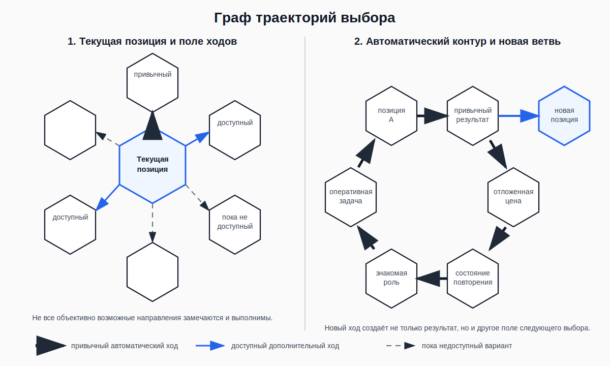

# Авторская визуальная модель «Граф траекторий выбора»

**Статус:** утверждено  
**Автор исходной идеи и наброска:** Андрей  
**Дата утверждения:** 5 июля 2026 года  
**Связанные положения:** SP-HCM-05, SP-HCM-06, SP-HCM-07, SP-HCM-08, SP-S1-P05, SP-S1-P06



## 1. Центральная идея

Модель показывает два масштаба одного процесса.

### Локальный масштаб

```text
текущая позиция
→ поле доступных ходов
→ следующий ход
→ новая позиция
```

### Масштаб жизненной траектории

```text
последовательность позиций и ходов
→ повторяющиеся маршруты
→ автоматические контуры
→ новые ветви
→ изменяющееся поле будущих возможностей
```

Главная формула:

> **Каждый ход создаёт поле следующего хода.**

Дополнительная формула:

> **Мы не выбираем всю жизнь сразу. Мы совершаем следующий ход и этим создаём позицию, из которой будет сделан следующий выбор.**

---

## 2. Элементы модели

## 2.1. Узел — текущая позиция

Узел обозначает не только точку времени, но всю актуальную конфигурацию:

- внешнюю ситуацию;
- физическое и эмоциональное состояние;
- воспринятую модель происходящего;
- активированный образ себя;
- оперативную задачу;
- ресурсы и ограничения;
- последствия предыдущих действий;
- доступную внешнюю поддержку.

## 2.2. Поле ходов

Поле ходов — набор возможных продолжений из текущей позиции.

Необходимо различать:

```text
объективно существующий ход
≠
замеченный ход
≠
психологически доступный ход
≠
реально выполненный ход
```

## 2.3. Стрелка — следующий ход

Стрелка может обозначать:

- действие;
- отказ от действия;
- паузу;
- остановку продолжения;
- изменение масштаба;
- снижение ущерба;
- исправление последствий;
- обращение за помощью;
- изменение условий следующего цикла.

## 2.4. Новая позиция

Результатом хода является не только внешний итог.

Ход меняет:

- состояние;
- фактическую ситуацию;
- последствия;
- образ себя;
- доверие к собственной способности действовать;
- доступность следующих вариантов;
- вероятность повторения знакомого маршрута.

## 2.5. Автоматический контур

Автоматический контур — повторяющийся замкнутый маршрут:

```text
позиция
→ привычное действие
→ немедленный результат
→ отложенная цена
→ состояние, повышающее вероятность повторения
→ знакомая позиция
```

Контур не обязан возвращать человека в буквально идентичное состояние. Новая позиция может быть усиленной версией прежней: с большей усталостью, стыдом, долгом, риском или недоверием к себе.

## 2.6. Новая ветвь

Новая ветвь возникает, когда доступный дополнительный ход создаёт другую следующую позицию.

Она не обязана немедленно уничтожить весь автоматический контур. Её значение состоит в том, что поле следующего выбора уже отличается от привычного.

---

## 3. Связь с SP-S1-P05 и SP-S1-P06

Для первой ступени центральный вопрос доступности:

> **Какой ход из текущей позиции человек действительно способен заметить и выполнить сейчас?**

Граф не утверждает, что человеку доступны все нарисованные направления.

Доступная точка определяется пересечением:

1. различимости;
2. выполнимости;
3. влияния на дальнейшую траекторию.

SP-S1-P06 добавляет границу восприятия: привычная толстая линия может переживаться не как один маршрут среди других, а как единственно существующее продолжение текущей позиции.

```text
привычный маршрут
переживается как
объективно неизбежное продолжение
```

Это переживание не доказывает ни наличие свободного доступа ко всем другим линиям, ни полную предопределённость дальнейшей цепочки.

Поэтому на чистовой схеме используются разные типы линий:

- **толстая линия** — привычный автоматический ход;
- **обычная сплошная линия** — замеченный и доступный дополнительный ход;
- **пунктирная линия** — объективно возможный, но пока не доступный или не замеченный ход;
- **замкнутый маршрут** — автоматический контур;
- **выходящая ветвь** — ход, создающий новую позицию.

---

## 4. Связь с моделью изменения

## SP-HCM-05 — действие изменяет действующего

Каждая стрелка создаёт не только результат, но и внутреннее обучение следующего узла.

## SP-HCM-06 — обратная связь

Последствия перехода могут укрепить привычный маршрут или дать данные для изменения следующего хода.

## SP-HCM-07 — множественные точки восстановления

Новая ветвь может возникнуть до действия, во время него, после поступка, при снижении ущерба, восстановлении или подготовке следующего цикла.

## SP-HCM-08 — повторяющиеся циклы

Многократное прохождение определённых маршрутов изменяет вероятность будущих переходов и формирует устойчивую конфигурацию.

---

## 5. Границы метафоры

### Шесть сторон не означают шесть вариантов

Шестиугольник используется как визуальный модуль соединения, а не как буквальная мера количества выборов.

### Не все ходы равны

Варианты отличаются:

- доступностью;
- ценой;
- риском;
- обратимостью;
- временем последствий;
- необходимостью внешней поддержки.

### Не все переходы обратимы

Некоторые действия создают необратимые последствия или закрывают часть будущих возможностей.

### Граф не означает полного контроля

Человек не выбирает все исходные условия, первую реакцию и действия других людей.

Он может участвовать только в доступной части дальнейшей траектории.

### Граф не обвиняет человека в его позиции

Текущая позиция может быть создана болезнью, насилием, потерей, социальными условиями, чужими поступками и ограниченными ресурсами.

Модель показывает доступное участие в дальнейшем, а не полную авторскую ответственность за всё произошедшее.

### Визуальная ясность не равна практической доступности

Линию легко увидеть на схеме, но реальный ход может требовать навыка, подготовки, поддержки или профессиональной помощи.

### Неизбежность нельзя объявлять только внутренней ошибкой

Реальные ограничения могут резко сужать поле. SP-S1-P06 относится к переживанию полной предопределённости продолжения, а не к отрицанию объективной угрозы, зависимости, болезни, истощения или отсутствия ресурсов.

---

## 6. Будущее применение

На последующих фазах модель может стать основой для:

- карты одного повторяющегося эпизода;
- карты автоматического контура;
- поиска места первого обнаружения;
- различения привычного и дополнительного хода;
- фиксации новой позиции после действия;
- анализа отложенной цены;
- проектирования следующего цикла;
- рабочего листа;
- карточек;
- интерактивной схемы;
- интерфейса сопровождения.

До Фазы 5 модель не превращается в утверждённую практику. До Фазы 7 не утверждаются форма подачи, длительность и носитель. До Фазы 9 не утверждается цифровая реализация.

---

## 7. Обязательные термины

- SP-TERM-CURRENT-POSITION — текущая позиция;
- SP-TERM-FIELD-OF-MOVES — поле ходов;
- SP-TERM-AVAILABLE-MOVE — доступный ход;
- SP-TERM-CHOICE-WINDOW — функциональное окно участия;
- SP-TERM-TRAJECTORY-GRAPH — граф траекторий;
- SP-TERM-AUTOMATIC-CONTOUR — автоматический контур;
- SP-TERM-NEXT-POSITION — следующая позиция;
- SP-TERM-INEVITABLE-CONTINUATION — иллюзия неизбежного продолжения.

---

## 8. Короткая легенда

```text
узел = текущая позиция
стрелка = ход
толстая стрелка = привычный автоматический ход
сплошная тонкая стрелка = доступный дополнительный ход
пунктир = пока недоступный или незамеченный вариант
замкнутый маршрут = автоматический контур
новая ветвь = изменение траектории
```

Главное правило использования:

> **Схема должна не демонстрировать человеку абстрактную свободу, а помогать находить один дополнительный ход, реально доступный из его текущей позиции.**
