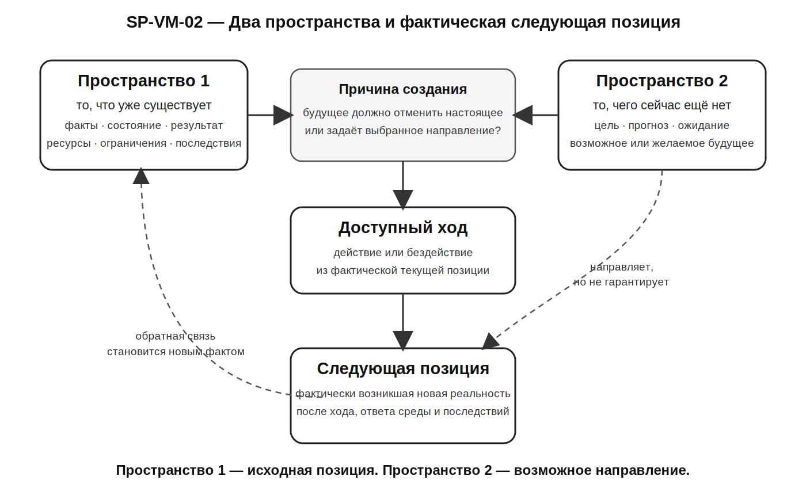

# SP-VM-02 — Пространство 1, Пространство 2 и фактическая следующая позиция

**Статус:** утверждено  
**Дата утверждения:** 12 июля 2026 года  
**Концептуальный источник:** Билл Вильямс, модель «Пространства 1» и «Пространства 2»  
**Адаптация и архитектурная интеграция:** Selection Point  
**Связанные положения:** SP-HCM-01, SP-HCM-05, SP-HCM-06, SP-HCM-09, SP-S2-P02–SP-S2-P05  
**Связанные термины:** SP-TERM-SPACE-1, SP-TERM-SPACE-2, SP-TERM-CURRENT-POSITION, SP-TERM-NEXT-POSITION, SP-TERM-AVAILABLE-MOVE



## 1. Назначение модели

Модель различает четыре элемента:

```text
Пространство 1
= то, что уже существует сейчас

Пространство 2
= то, чего сейчас ещё нет,
  но что представлено как возможное,
  ожидаемое или желаемое будущее

ход
= участие человека в создании продолжения

фактическая следующая позиция
= реально возникшая новая конфигурация
  после действия, ответа среды и последствий
```

Главное различение:

> **Пространство 2 может направлять ход, но не является гарантией и не равно фактической следующей позиции.**

## 2. Пространство 1

Пространство 1 — фактически подтверждённая текущая позиция:

- то, что уже произошло;
- наблюдаемые внешние обстоятельства;
- совершённые действия и бездействие;
- реальный результат;
- текущее физическое и эмоциональное состояние;
- имеющиеся ресурсы и ограничения;
- уже возникшие последствия.

Внутри Selection Point Пространство 1 не равно всей объективной реальности целиком. Человек может видеть ситуацию неполно или ошибочно. Поэтому фактическая часть текущей позиции уточняется через различение реальной ситуации, воспринятой модели и доступных данных.

Короткая формула:

> **Пространство 1 — не приговор и не то, что нужно отменить. Это исходный факт текущего хода.**

## 3. Пространство 2

Пространство 2 — представленное будущее, которого пока нет:

- цель;
- прогноз;
- ожидание;
- образ результата;
- возможное направление;
- гипотеза;
- намерение;
- фантазия;
- сценарное требование.

Само наличие Пространства 2 не является проблемой. Без представления о том, чего ещё нет, невозможно осознанно создавать новое продолжение.

Ключевой вопрос:

> **Почему человек создаёт именно это Пространство 2 и какую функцию оно должно выполнить относительно Пространства 1?**

## 4. Пространство 2 не равно следующей позиции

```text
Пространство 2
= предполагаемое или выбранное будущее

следующая позиция
= фактически возникшая реальность следующего цикла
```

Фактическая следующая позиция зависит не только от намерения, но и от:

- качества восприятия;
- состояния;
- выбранного действия или бездействия;
- реальной доступности хода;
- действий других людей;
- условий среды;
- случайности;
- ограничений;
- накопленных последствий.

Поэтому:

```text
выбранное направление
≠ гарантированный результат
```

И одновременно:

```text
отсутствие гарантии
≠ отсутствие авторства
```

## 5. Компенсаторная структура

Пространство 2 может создаваться как обязательный способ уничтожить, исправить или опровергнуть Пространство 1.

```text
Пространство 1 переживается как внутренне недопустимое
→ факт превращается в приговор личности
→ Пространство 2 должно исправить настоящее или самого человека
→ возникает срочность
→ компенсаторный ход получает приоритет
→ временное облегчение или доказательство
→ фактическая следующая позиция сохраняет прежнюю организацию
```

В этой структуре будущее не просто желательно. Оно становится условием восстановления контроля, целостности, самооценки или допустимого образа себя.

Короткая формула:

> **Пространство 2 используется не для создания будущего, а для отмены настоящего.**

## 6. Созидающая структура

```text
Пространство 1 признаётся текущим фактом
→ факт отделяется от глобального приговора личности
→ Пространство 2 различается как возможное направление
→ проверяется причина его выбора
→ совершается доступный ход
→ возникает фактическая следующая позиция
→ результат используется как обратная связь
```

Признание Пространства 1 не означает:

- что оно нравится;
- что оно справедливо;
- что его не нужно менять;
- что человек обязан смириться;
- что опасное или разрушительное нельзя прекратить.

Оно означает только:

> **Этот факт уже существует, и следующий ход начинается из него, а не из требования сделать вид, что его не было.**

## 7. Точка выбора второй ступени

SP-S2-P05 использует модель для различения:

```text
что есть сейчас?
→ чего сейчас ещё нет?
→ почему мне необходимо это создать?
→ будущее должно исправить меня и отменить настоящее
  или является выбранным направлением?
→ какой ход доступен из фактической текущей позиции?
```

Центральная формула:

> **Точка выбора возникает, когда человек способен удержать Пространство 1 как текущий факт и Пространство 2 как возможное направление, не используя будущее для отрицания настоящего или восстановления собственной ценности.**

## 8. Связь с SP-S2-P04

SP-S2-P04 объясняет, почему Пространство 2 может становиться компенсаторным:

```text
неприемлемое Пространство 1
→ угроза сценарной идентичности
→ Пространство 2 должно восстановить или опровергнуть образ себя
→ сценарная задача
→ оперативная задача
→ компенсаторный ход
```

Поэтому борьба с нежелательным может менять форму поведения, не меняя систему отсчёта.

## 9. Связь с SP-HCM-09 и SP-VM-01

SP-HCM-09:

> **Контроль предполагает возможность заранее получить желаемый результат. Создание происходит независимо от контроля.**

SP-VM-01 показывает:

```text
текущая позиция
→ ход
→ следующая позиция
```

SP-VM-02 добавляет:

```text
Пространство 1
+ представленное Пространство 2
+ причина его создания
→ выбранный ход
→ фактическая следующая позиция
```

Модели не дублируют друг друга:

- SP-VM-01 показывает траекторию позиций и ходов;
- SP-VM-02 показывает отношение текущего факта, представленного будущего и функции выбора.

## 10. Торговый пример

```text
Пространство 1:
сделка закрыта по стопу;
потерян 1% капитала;
прогноз не подтвердился;
есть раздражение;
нового подтверждённого сигнала нет

Пространство 2:
вернуть убыток;
закончить день в плюсе;
снова почувствовать контроль
```

Компенсаторная структура:

```text
«Я не могу закончить день с убытком»
→ следующая сделка должна исправить прошлую
→ вход без подтверждённого сигнала
```

Созидающая структура:

```text
«Убыток уже является текущим фактом»
→ следующая сделка не исправляет прошлую
→ обрабатывается только следующая подтверждённая рыночная ситуация
```

Прибыль остаётся желательной, но перестаёт быть обязательным средством восстановления личности или контроля.

## 11. Границы модели

SP-VM-02 не утверждает:

- что Пространство 1 полностью известно человеку;
- что текущий факт всегда нужно одобрять или терпеть;
- что движение от опасности является ошибкой;
- что сильное желание результата само по себе патологично;
- что Пространство 2 обязательно является фантазией или самообманом;
- что выбранное будущее гарантированно возникнет;
- что человек контролирует рынок, других людей или случайность;
- что любая цель скрыто компенсирует самооценку;
- что отсутствие внутреннего напряжения гарантирует правильный ход;
- что все альтернативы одинаково доступны;
- что модель заменяет предметную, медицинскую, финансовую или психологическую экспертизу.

## 12. Внешний источник и статус проверки

Модель концептуально опирается на описание «Пространства 1» и «Пространства 2» у Билла Вильямса, предоставленное Андреем для архитектурного рассмотрения.

Selection Point:

- не объявляет свою адаптацию дословной реконструкцией текста Вильямса;
- не считает внешнюю концепцию доказательством эффективности системы;
- сохраняет необходимость библиографической проверки первичных изданий до публичного автороведческого сопоставления;
- использует собственные утверждённые различения текущей позиции, хода, контроля, создания и следующей позиции.

## 13. Короткие формулы

> **Пространство 1 — исходная позиция. Пространство 2 — возможное направление. Следующая позиция — фактически созданное продолжение.**

> **Пространство 2 может направлять ход, но не может гарантировать следующую позицию.**

> **Главный вопрос — не только чего я хочу, но и зачем будущее должно стать другим.**

> **Настоящее становится исходной позицией, а не тем, что будущее обязано исправить.**
